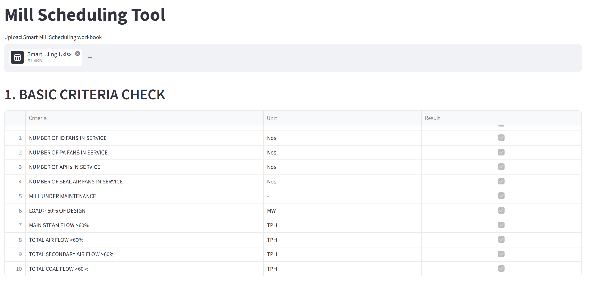
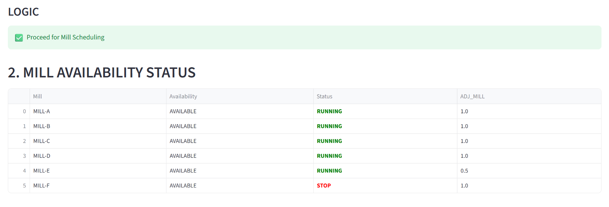
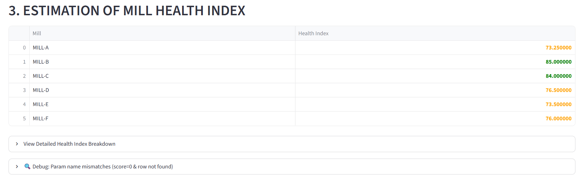
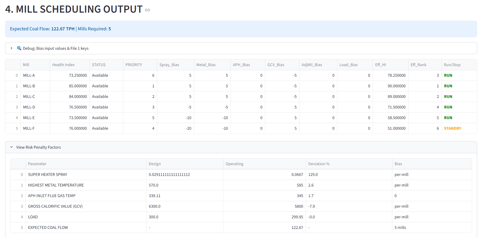
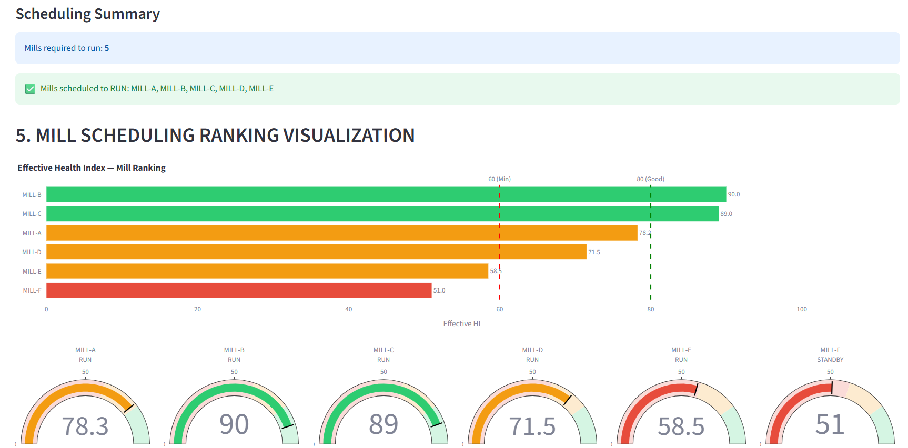
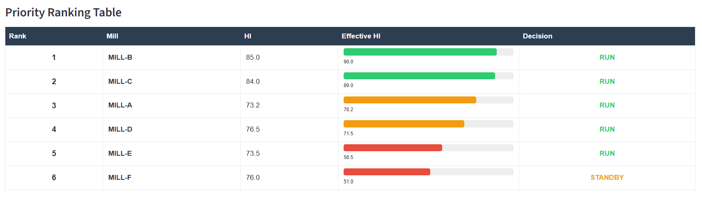

# Smart Mill Scheduling Application

A Python and Streamlit based application for thermal power plant mill scheduling.

## Features

- Calculates Expected Coal Flow
- Computes Mills Required
- Determines Mill Availability
- Generates RUN / STANDBY / STOP recommendations
- Interactive Streamlit Dashboard
- Excel Input and Output support

## Business Logic

### Expected Coal Flow

Expected Coal Flow =
(Plant Gross Heat Rate × Load) / Gross Calorific Value

### Mills Required

Mills Required =
Ceiling(Expected Coal Flow / Allowable Coal Flow Per Mill)

### Mill Status

- >70 : Available
- 60-70 : Standby
- 50-59 : Emergency
- <50 : Not Available

### Scheduling Logic

Available mills are selected based on priority and mills required.

## Technology Stack

- Python
- Streamlit
- Pandas
- Excel Integration

## Run Application

# Smart Mill Scheduling App

## Application Screenshots

### 1. Home Page


### 2. Input Parameters


### 3. Coal Flow Calculation


### 4. Mill Status Evaluation


### 5. Scheduling Results




```bash
pip install -r requirements.txt
streamlit run app.py
